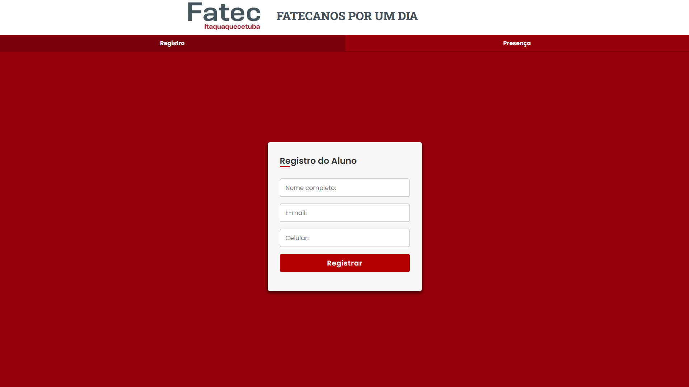

# 🎓 Fatecano por um Dia

<p align="center">
  
</p>

Um sistema completo para gerenciar inscrições, confirmação de presença e envio de certificados do evento **"Fatecano por um Dia"**, realizado para a **Fatec de Itaquaquecetuba**.

## 📦 Visão Geral

Este projeto foi desenvolvido para facilitar a organização de um evento acadêmico, automatizando:

- Registro de participantes via formulário online.
- Envio de e-mails com código de identificação.
- Confirmação de presença via código.
- Envio automatizado de certificados em PDF.
- (Opcional) Envio de mensagens por WhatsApp (via Twilio).

---

## 🛠️ Tecnologias Utilizadas

- **Node.js** & **Express**
- **ODBC** para integração com banco de dados Microsoft Access
- **nodemailer** para envio de e-mails
- **Twilio** para envio via WhatsApp
- **HTML/CSS** (formulário simples em `public/`)

---

## 🔧 Estrutura do Projeto

```
├── public/
│   └── registro.html         # Formulário de inscrição
├── sendemail.js              # Envia e-mails com o ID do aluno
├── server.js                 # Servidor principal Express
├── test.js                   # Gera e envia certificados em PDF
├── whatsapp.js               # (Opcional) Envia ID pelo WhatsApp via Twilio
├── certificado.js            # (Não enviado, mas necessário para gerar PDFs)
└── Aluno.accdb               # Banco de dados Access (não incluído)
```

---

## 🚀 Como Rodar o Projeto

### 1. Instale as dependências

```bash
npm install express body-parser nodemailer odbc twilio
```

### 2. Configure o Banco de Dados

- Certifique-se de que o arquivo `Aluno.accdb` esteja no caminho especificado no código (`C:\Users\rafae\Desktop\evento\Registro_evento\Aluno.accdb`).
- Edite o caminho se estiver diferente.

### 3. Configure os dados sensíveis

Altere os seguintes campos nos arquivos:

#### Em `sendemail.js`, `test.js`:

```js
auth: {
  user: 'seuemail@gmail.com',
  pass: 'senha_app', // Senha de app gerada no Gmail
}
```

#### Em `whatsapp.js`:

```js
const accountSid = 'SEU_TWILIO_SID';
const authToken = 'SEU_TWILIO_AUTH_TOKEN';
from: 'whatsapp:+14155238886', // Sandbox do Twilio
```

> ⚠️ O envio via WhatsApp requer uma conta paga no Twilio.

---

## 💻 Executando

### 🔹 Rodar o servidor Express

```bash
node server.js
```

Acesse: `http://localhost:3000` ou `http://<SEU_IP_LOCAL>:3000`

### 🔹 Enviar e-mails com ID para os alunos, mas sem criar certificado (caso já tenha o certificado).

```bash
node sendemail.js
```

### 🔹 Enviar certificados (requer o módulo `certificado.js`). Cria os certificados e envia logo em seguida.

```bash
node test.js
```

### 🔹 (Opcional) Enviar mensagens no WhatsApp (requer uma versão paga para funcionar completamente)

```bash
node whatsapp.js
```

---

## 🧪 Funcionalidades

- [x] Registro com validação de e-mail único
- [x] Geração de ID automático com confirmação via banco
- [x] Presença confirmada com código ID
- [x] Certificados personalizados em PDF
- [x] Interface amigável para o aluno
- [ ] Painel administrativo (não pretendo fazer, faça se quiser.)

---

## 🎯 Objetivo

O projeto tem como objetivo oferecer uma experiência organizada e automatizada tanto para a equipe da Fatec quanto para os alunos visitantes, promovendo a instituição com qualidade e tecnologia.

---

## 📄 Licença

Este projeto é de uso educacional e interno da Fatec Itaquaquecetuba. Modificações e melhorias são bem-vindas sob atribuição.

---

## 📬 Contato

Se tiver dúvidas ou sugestões, entre em contato:
 
🏫 Fatec de Itaquaquecetuba – Gestão do Evento
